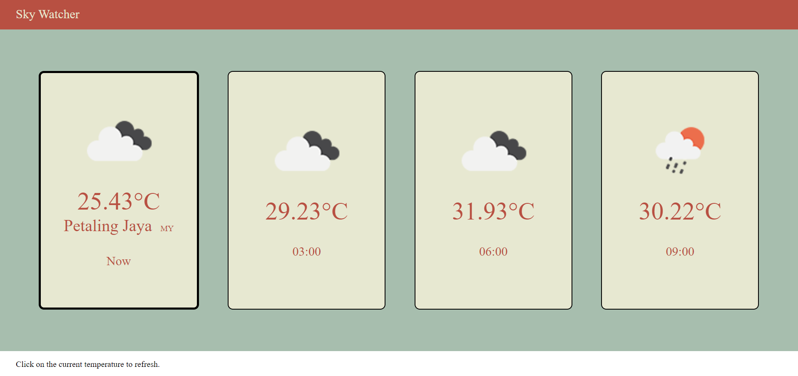

# SkyWatcher Weather Web App 🌤️

This is a simple weather web application that provides current and forecasted weather information for the user's current location. The app fetches data from the [OpenWeather API](https://openweathermap.org/api) and displays weather details such as temperature, weather conditions, and forecast for the next few hours.

## Features

- Displays current weather conditions for the user's city.
- Provides weather forecast for the next few hours.
- Shows temperature, weather icon, and time of forecast.
- Responsive and user-friendly interface.

## Technologies Used

- **HTML**: Structure of the web app.
- **CSS**: Styling the user interface.
- **JavaScript**: Fetching weather data from the OpenWeather API and updating the UI.
- **OpenWeather API**: Weather data provider.

## Screenshots



### Prerequisites

- A modern web browser.
- A text editor or IDE (e.g., VS Code, Sublime Text).
- A valid OpenWeather API key. Sign up for a free API key [here](https://home.openweathermap.org/users/sign_up).

### Installation

1. **Clone the repository:**

   ```bash
   git clone https://github.com/JustinLeongHK/weather-app.git
   ```
